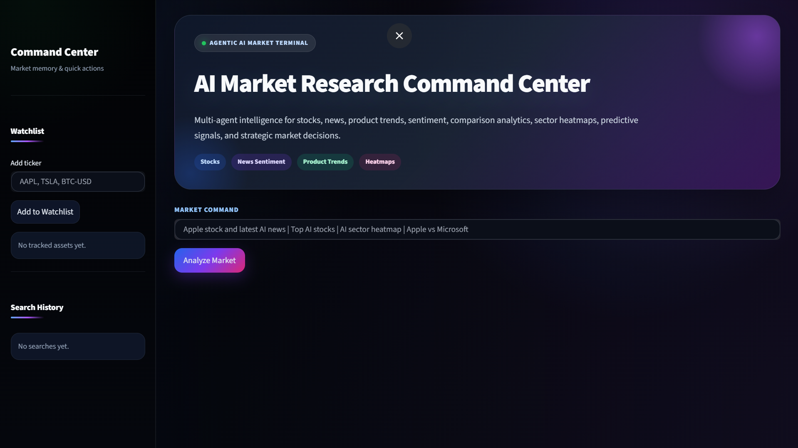
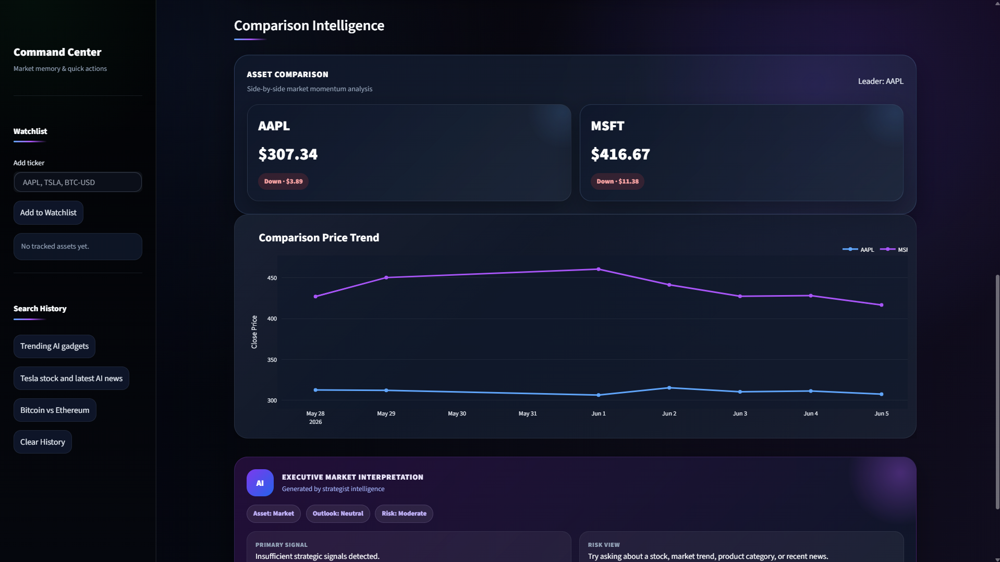
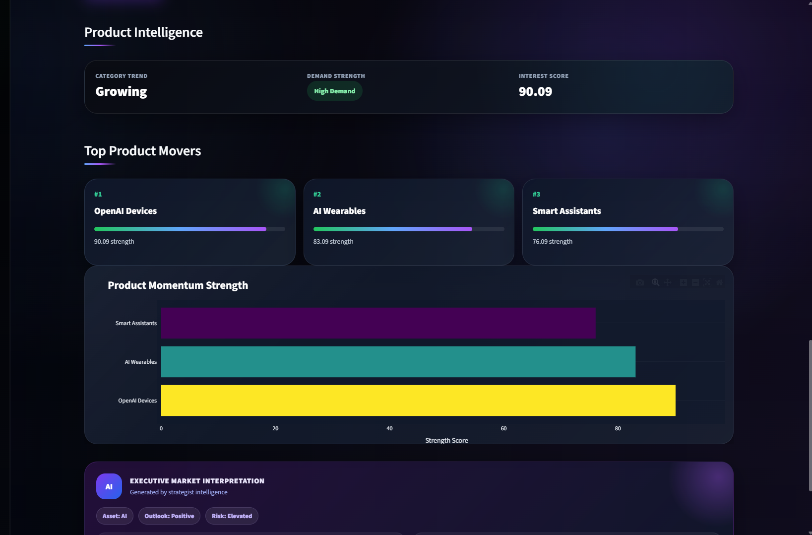
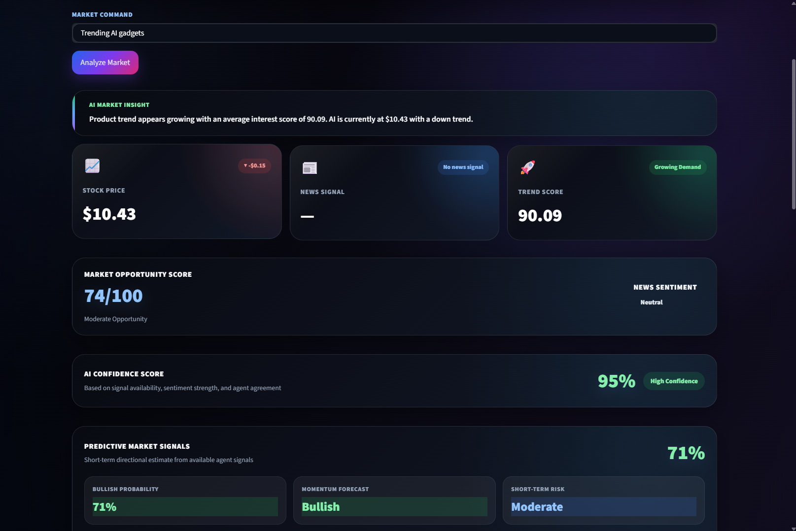
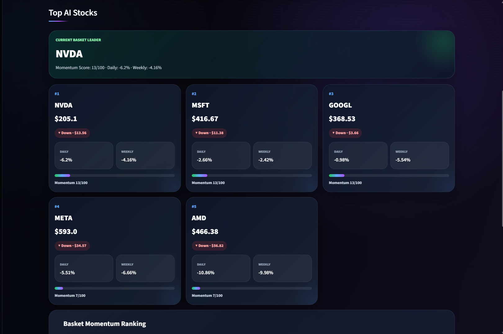

# AI Market Research Command Center


A premium **multi-agent AI market intelligence dashboard** built with Streamlit.

The system analyzes stocks, crypto assets, market news, product trends, sentiment, comparison queries, multi-asset queries, sector heatmaps, screener dashboards, predictive signals, and strategic AI insights inside a modern dark terminal-style interface.

> **Note:** API keys are not included in this repository. You must add your own API keys locally using a `.env` file.

---

## Preview











```


## Key Features

* Multi-agent market intelligence system
* Advanced query intent detection
* Stock price intelligence
* Crypto asset intelligence
* Multi-asset query handling
* Stock comparison mode
* Comparison overlay charts
* Latest market/news intelligence
* Article relevance ranking
* News sentiment analysis
* Market sentiment intelligence panel
* Product trend intelligence
* Top product movers
* Market Opportunity Score
* AI Confidence Score
* Predictive Market Signals
* Strategic AI Insight
* Screener dashboards
* Sector heatmaps
* Persistent watchlist
* Persistent search history
* Async agent execution for faster responses
* Premium dark terminal UI

---

## Example Queries

```txt
Apple stock
Tesla stock and latest AI news
Trending AI gadgets
Trending AI gadgets and latest AI news
Apple vs Microsoft stock
Bitcoin vs Ethereum
Apple stock and Bitcoin price today
Tesla and Nvidia stock
Top AI stocks
Best semiconductor stocks
Top EV stocks
AI sector heatmap
Crypto heatmap
```

---

## Project Workflow

```text
User Market Query
        ↓
Intent Detection
        ↓
Agent Planning
        ↓
Parallel Agent Execution
        ↓
Stock / News / Product / Screener / Heatmap / Comparison Agents
        ↓
Aggregation Layer
        ↓
Sentiment + Confidence + Strategy Signals
        ↓
Premium Streamlit Dashboard
```

---

## Project Structure

```text
Ai_market_researcher/
│
├── agents/
│   ├── base_agent.py
│   ├── stock_agent.py
│   ├── news_agent.py
│   ├── product_agent.py
│   ├── comparison_agent.py
│   ├── multi_asset_agent.py
│   ├── screener_agent.py
│   ├── heatmap_agent.py
│   └── strategist_agent.py
│
├── orchestrator/
│   ├── core.py
│   ├── planner.py
│   ├── intent_detector.py
│   ├── aggregator.py
│   └── async_runner.py
│
├── services/
│   ├── yahoo_finance_service.py
│   ├── news_api_service.py
│   ├── product_trend_service.py
│   ├── sentiment_service.py
│   └── entity_parser.py
│
├── ui/
│   ├── dashboard.py
│   ├── components.py
│   └── styles.css
│
├── utils/
│   └── storage.py
│
├── data/
│   ├── watchlist.json
│   └── search_history.json
│
├── main.py
├── requirements.txt
├── .env.example
├── .gitignore
└── README.md
```

---

## API Keys

API keys are **not included** in this project for security reasons.

Create a `.env` file in the project root:

```txt
NEWS_API_KEY=your_real_news_api_key_here
```

You can get a News API key from:

```txt
https://newsapi.org/
```

---

## Setup Instructions

### 1. Clone the Repository

```powershell
git clone https://github.com/noumanshahid-1/ai-market-research-command-center.git
cd ai-market-research-command-center
```
---

### 2. Create Virtual Environment

```powershell
python -m venv venv
venv\Scripts\activate
```

---

### 3. Install Dependencies

```powershell
pip install -r requirements.txt
```

---

### 4. Add Environment Variables

Create a `.env` file:

```powershell
copy .env.example .env
```

Then add your real API key inside `.env`:

```txt
NEWS_API_KEY=your_real_news_api_key_here
```

---

### 5. Run the Application

```powershell
streamlit run main.py
```

Then open:

```txt
http://localhost:8501
```

---

## Requirements

```txt
streamlit
yfinance
pandas
plotly
newsapi-python
pytrends
textblob
python-dotenv
requests
```

---

## Large Files Not Included

```txt
venv/
.venv/
__pycache__/
.env
data/watchlist.json
data/search_history.json
*.csv
*.xlsx
*.parquet
*.db
*.sqlite
*.log
outputs/
cache/
```

These files are ignored because they are either local, private, generated at runtime, or too large for GitHub.

---

## Regression Test Queries

Before demo or deployment, test:

```txt
Apple stock
Tesla stock and latest AI news
Trending AI gadgets
Trending AI gadgets and latest AI news
Apple vs Microsoft stock
Bitcoin vs Ethereum
Apple stock and Bitcoin price today
Tesla and Nvidia stock
Top AI stocks
Best semiconductor stocks
AI sector heatmap
Crypto heatmap
```

Expected result:

* No app crash
* No raw HTML visible
* No white input boxes
* No missing API key error after `.env` setup
* Watchlist and search history work locally
* Charts render correctly
* Screener, comparison, heatmap, stock, news, and product modes work correctly

---

## Known Limitations

* News results depend on News API availability and plan limits.
* Financial data depends on Yahoo Finance availability.
* Product trend intelligence is based on trend signals and not direct Amazon scraping.
* The system is designed as a market intelligence prototype, not financial advice.
* Predictive signals are heuristic and should not be treated as investment recommendations.

---

## Disclaimer

This project is for educational, research, and portfolio demonstration purposes only.

It is not financial advice.

Always verify market data from official financial sources before making investment decisions.

---

## Future Improvements

* Add user authentication
* Add portfolio mode
* Add PDF report export
* Add advanced backtesting
* Add database persistence
* Add Docker deployment
* Add LLM-powered report generation
* Add real-time websocket updates
* Add sector-level financial fundamentals
* Add analyst recommendation aggregation

---

## Author

**Nouman Shahid**

AI Market Research Command Center
Multi-Agent Market Intelligence Project
